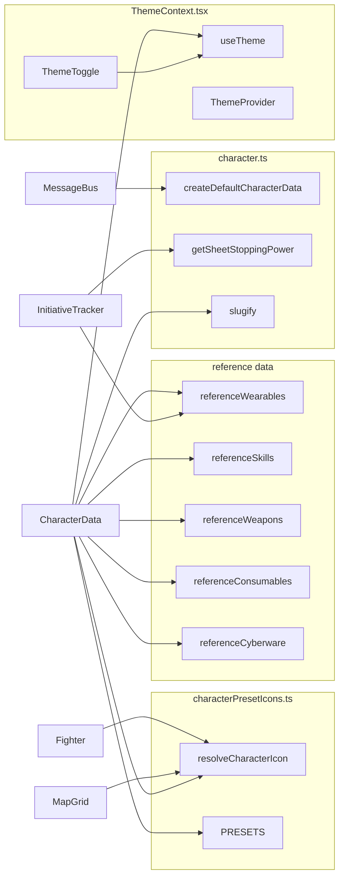

# Dependency graphs

This document describes how project source files and their exported functions depend on each other. Only internal dependencies are shown (no `node_modules`).

- **File dependency graph:** which source files import which other project files. Arrow A → B means “A imports from B”.
- **Function dependency graph:** which exported functions or entry points use which other project exports (cross-module calls or use of types/constants). Arrow F → G means “F calls or uses G”.

---

## File dependency graph

Nodes are source files under `src/`. Edges go from importer to imported. Path alias `@/` is resolved to `src/`.

```mermaid
flowchart TB
  subgraph app [app]
    page[page.tsx]
    layout[layout.tsx]
  end
  subgraph contexts [contexts]
    MessageBusContext[MessageBusContext.tsx]
    ThemeContext[ThemeContext.tsx]
  end
  subgraph pages [pages]
    ActivityLog[ActivityLog.tsx]
    CharacterData[CharacterData.tsx]
    DiceRoller[DiceRoller.tsx]
    InitiativeTracker[InitiativeTracker.tsx]
    MapGrid[MapGrid.tsx]
  end
  subgraph comps [comps]
    MessageBus[MessageBus.tsx]
    Fighter[Fighter.tsx]
    SideMenu[sideMenu.tsx]
    AnimatedList[AnimatedList.tsx]
    AudioCard[AudioCard.tsx]
    MentionText[MentionText.tsx]
  end
  subgraph data [data]
    characterPresetIcons[characterPresetIcons.ts]
    refIndex[reference/index.ts]
    refWearables[reference/wearables.ts]
    refSkills[reference/skills.ts]
    refWeapons[reference/weapons.ts]
    refConsumables[reference/consumables.ts]
    refCyberware[reference/cyberware.ts]
  end
  subgraph types [types]
    character[character.ts]
    reference[reference.ts]
  end
  page --> MessageBus
  page --> SideMenu
  page --> ThemeContext
  page --> MessageBusContext
  page --> ActivityLog
  page --> CharacterData
  page --> InitiativeTracker
  page --> MapGrid
  page --> AudioCard
  ActivityLog --> DiceRoller
  ActivityLog --> AnimatedList
  ActivityLog --> MessageBusContext
  CharacterData --> MessageBusContext
  CharacterData --> MentionText
  CharacterData --> refSkills
  CharacterData --> refWeapons
  CharacterData --> refWearables
  CharacterData --> refConsumables
  CharacterData --> refCyberware
  CharacterData --> characterPresetIcons
  CharacterData --> reference
  CharacterData --> character
  DiceRoller --> MessageBusContext
  InitiativeTracker --> Fighter
  InitiativeTracker --> MessageBusContext
  InitiativeTracker --> character
  InitiativeTracker --> refWearables
  MapGrid --> MessageBusContext
  MapGrid --> characterPresetIcons
  MessageBus --> MessageBusContext
  MessageBus --> character
  Fighter --> MessageBusContext
  Fighter --> characterPresetIcons
  SideMenu --> MessageBusContext
  AnimatedList --> MessageBusContext
  AudioCard --> MessageBusContext
  MessageBusContext --> character
  refWearables --> reference
  refWeapons --> reference
  refConsumables --> reference
  refCyberware --> reference
  refSkills --> reference
  refIndex --> refWeapons
  refIndex --> refWearables
  refIndex --> refConsumables
  refIndex --> refCyberware
  refIndex --> refSkills
```

Note: `layout.tsx` has no internal project imports. `ThemeContext.tsx` and type-only files (`character.ts`, `reference.ts`) have no outgoing edges to other project files.

---

## Function dependency graph

Nodes are exported functions or key constants. Edges mean “calls” or “uses” (cross-module). Internal helpers (e.g. `svgToDataUrl` in characterPresetIcons) are not shown.

Components such as `MessageBus`, `InitiativeTracker`, `Fighter`, `MapGrid`, `CharacterData`, and `ThemeToggle` are shown as callers; they use context and other exports as indicated. `slugify` is used by CharacterData (notes/contacts).
